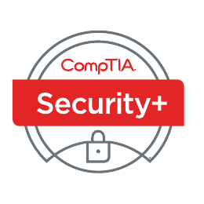

# CompTIA-SecurityPlus-SY0-701-Notes-and-Cheatsheet

**EXAM NUMBER: SY0-701**

---
## عن الامتحان  
امتحان شهادة CompTIA Security+ سيعتمد أن المتقدم الناجح يمتلك المعرفة والمهارات المطلوبة لـ:  
• تقييم وضع الأمان في بيئة المؤسسات وتوصية وتنفيذ حلول الأمان المناسبة.  
• مراقبة وتأمين البيئات الهجينة، بما في ذلك السحابة، والمحمول، وإنترنت الأشياء (IoT).  
• العمل مع الوعي بالتنظيمات والسياسات المطبقة، بما في ذلك مبادئ الحوكمة والمخاطر والامتثال.  
• تحديد وتحليل والاستجابة للأحداث والحوادث الأمنية.

**تطوير الامتحان**  
تنتج امتحانات CompTIA من ورش عمل الخبراء في الموضوعات ونتائج المسوحات على مستوى الصناعة بشأن المهارات والمعرفة المطلوبة للمحترفين في تكنولوجيا المعلومات.

**سياسة استخدام المواد المعتمدة من CompTIA**  
شهادة CompTIA، LLC ليست مرتبطة ولا تقر أو تدعم أو تروج لاستخدام أي محتوى تقدمه مواقع التدريب غير المعتمدة من طرف ثالث (المعروفة بـ "brain dumps"). الأفراد الذين يستخدمون هذه المواد للتحضير لأي امتحان من CompTIA سيتم إلغاء شهاداتهم وتعليقهم من إجراء الامتحانات المستقبلية وفقًا لاتفاقية المرشح من CompTIA. في محاولة للتواصل بشكل أوضح حول سياسات الامتحان الخاصة بـ CompTIA فيما يتعلق باستخدام المواد الدراسية غير المعتمدة، توجه CompTIA جميع المرشحين للشهادات إلى سياسات امتحان الشهادات من CompTIA. يُرجى مراجعة جميع السياسات الخاصة بـ CompTIA قبل بدء عملية الدراسة لأي امتحان من CompTIA. سيتعين على المرشحين الامتثال لاتفاقية المرشح من CompTIA. إذا كان لدى المرشح أي سؤال حول ما إذا كانت المواد الدراسية تعتبر غير معتمدة (المعروفة بـ "brain dumps")، يجب عليه/عليها الاتصال بـ CompTIA عبر [examsecurity@comptia.org](mailto:examsecurity@comptia.org) للتأكيد.

**يرجى الملاحظة**  
القوائم من الأمثلة المقدمة بتنسيق النقاط ليست قوائم شاملة. قد تشمل الأمثلة الأخرى للتقنيات أو العمليات أو المهام المتعلقة بكل هدف في الامتحان، رغم أنها ليست مدرجة أو مغطاة في هذا المستند الخاص بالأهداف. تقوم CompTIA بمراجعة محتوى امتحاناتها بشكل مستمر وتحديث أسئلة الامتحانات لضمان أن الامتحانات الحالية، وأن أمن الأسئلة محمي. عند الضرورة، سننشر امتحانات محدثة بناءً على الأهداف الحالية للامتحان. يُرجى العلم أن جميع مواد التحضير ذات الصلة للامتحانات ستظل صالحة.

---
**تفاصيل الامتحان**  
الامتحان المطلوب: SY0-701  
عدد الأسئلة: حد أقصى 90  
أنواع الأسئلة: متعددة الاختيارات وأسئلة قائمة على الأداء  
مدة الامتحان: 90 دقيقة  
الخبرة الموصى بها: حد أدنى من سنتين من الخبرة في إدارة تكنولوجيا المعلومات مع التركيز على الأمان، والخبرة العملية في أمن المعلومات التقنية، والمعرفة الواسعة بمفاهيم الأمان.

---
**أهداف الامتحان (المجالات)**  
الجدول أدناه يوضح المجالات التي يتم قياسها في هذا الامتحان ومدى تمثيلها.

|المجال|النسبة المئوية للامتحان|
|---|---|
|1.0 مفاهيم الأمان العامة|12%|
|2.0 التهديدات، الثغرات، والتخفيفات|22%|
|3.0 بنية الأمان|18%|
|4.0 عمليات الأمان|28%|
|5.0 إدارة برنامج الأمان والإشراف|20%|
|**الإجمالي**|**100%**|

---

## 1.0 مفاهيم الأمان العامة (General Security Concepts)  

### 1.1 مقارنة و التمييز بين أنواع مختلفه من ضوابط الأمان (Compare and contrast various types of security controls)  

**الفئات (Categories)**:

**تقنية (Technical)**: تتعلق بالأدوات والتقنيات المستخدمة لحماية الأنظمة.  
_مثال_: جدران الحماية وبرامج مكافحة الفيروسات.  

**إدارية (Managerial)**: تتعلق بالسياسات والإجراءات التي يضعها المديرون لضمان الأمان.  
_مثال_: وضع سياسات للوصول الآمن إلى الشبكة.  

**تشغيلية (Operational)**: تتعلق بالإجراءات اليومية للحفاظ على الأمان.  
_مثال_: مراقبة الأنظمة بشكل مستمر للكشف عن الأنشطة غير المصرح بها.  

**مادية (Physical)**: تتعلق بحماية البنية التحتية المادية للمؤسسة.  
_مثال_: تأمين مداخل المباني باستخدام بطاقات الدخول أو الحراس الأمنيين.  

**أنواع الضوابط (Control types)**:

**وقائي (Preventive)**: يهدف إلى منع حدوث الهجمات أو الحوادث الأمنية.  
_مثال_: جدران الحماية وكلمات المرور المعقدة.  

**ردعي (Deterrent)**: يهدف إلى ردع المهاجمين عن محاولة الهجوم.  
_مثال_: اللافتات التحذيرية عن المراقبة.  

**كشفي (Detective)**: يهدف إلى اكتشاف الهجمات أو الحوادث الأمنية بعد وقوعها.  
_مثال_: أنظمة كشف التسلل (IDS).  

**تصحيحي (Corrective)**: يهدف إلى تصحيح الأضرار بعد حدوث الهجمات.  
_مثال_: استعادة البيانات من النسخ الاحتياطي.  

**تعويضي (Compensating)**: يستخدم كبديل عندما لا تكون الضوابط الوقائية فعّالة.  
_مثال_: استخدام المراقبة اليدوية في حالة تعطل النظام الآلي.  

**إرشادي (Directive)**: يهدف إلى توجيه السلوكيات في المنظمة لضمان الأمان.  
_مثال_: سياسات التدريب على الأمان للمستخدمين.  

### 1.2 تلخيص المفاهيم الأساسية للأمان (Summarize fundamental security concepts)  

**السرية (Confidentiality)**: ضمان أن المعلومات تبقى سرية ولا يتم الوصول إليها إلا من قبل الأشخاص المصرح لهم.  
_مثال_: تشفير البريد الإلكتروني لضمان عدم قراءته من قبل غير المصرح لهم.  

**التكامل (Integrity)**: ضمان أن البيانات لا يتم تعديلها أو التلاعب بها أثناء تخزينها أو نقلها.  
_مثال_: استخدام تجزئة البيانات للتحقق من أن الملف لم يتم تغييره.  

**التوافر (Availability)**: ضمان أن البيانات والخدمات تكون متاحة للاستخدام في أي وقت عند الحاجة.  
_مثال_: استخدام النسخ الاحتياطية لتأمين الوصول إلى البيانات في حال حدوث تعطل.  

**عدم الإنكار (Non-repudiation)**: ضمان أنه لا يمكن للأطراف إنكار مشاركتهم في عملية أو فعل معين.  
_مثال_: التوقيع الرقمي على البريد الإلكتروني يثبت هوية المرسل.  

**المصادقة (Authentication)، التفويض (Authorization)، والمحاسبة (Accounting) اختصارا (AAA)**:  

**المصادقة (Authentication)**: التأكد من هوية الشخص أو النظام.  
_مثال_: إدخال اسم المستخدم وكلمة المرور للتحقق من الهوية.  

**التفويض (Authorization)**: تحديد ما يمكن للمستخدم الوصول إليه بعد التأكد من هويته.  
_مثال_: منح الوصول إلى ملفات معينة حسب الدور الوظيفي.  

**المحاسبة (Accounting)**: تتبع الأنشطة التي يقوم بها المستخدم أو النظام داخل النظام لتوفير سجلات يمكن مراجعتها لاحقاً.  
_مثال_: تسجيل جميع الإجراءات والعمليات التي يقوم بها المستخدم داخل النظام لضمان تتبع الأنشطة بشكل دقيق.  

**المصادقة على الأشخاص (Authenticating people)**: هي عملية التأكد من هوية الشخص الذي يحاول الوصول إلى النظام أو الخدمة باستخدام معلومات مثل كلمة المرور أو بصمة الإصبع.  
_مثال_: إدخال اسم المستخدم وكلمة المرور لتأكيد هوية الشخص قبل السماح له بالوصول إلى حسابه.  

**المصادقة على الأنظمة (Authenticating systems)**: هي عملية التحقق من هوية الأنظمة أو الأجهزة للتأكد من أنها الأنظمة المصرح لها بالوصول إلى الشبكة أو الموارد.  
_مثال_: استخدام الشهادات الرقمية أو المفاتيح الخاصة للتحقق من هوية الخوادم أو الأنظمة قبل التواصل معها.  

**نماذج التفويض (Authorization models)**: هي الأساليب التي يتم من خلالها تحديد وتحكم الوصول إلى الموارد أو الأنظمة بناءً على معايير معينة، مثل دور المستخدم أو خصائصه.  

**التحكم بالوصول بناءً على الدور (Role-Based Access Control - RBAC)**:  
في هذا النموذج، يتم تحديد صلاحيات الوصول بناءً على دور المستخدم داخل المنظمة. يتم تعيين صلاحيات معينة لكل دور (مثل موظف، مدير، أو مشرف).  
مثال: الموظف العادي لديه صلاحيات قراءة فقط، بينما المدير لديه صلاحيات تعديل وإضافة بيانات.  

**التحكم بالوصول بناءً على القرار الشخصي (Discretionary Access Control - DAC)**:  
في هذا النموذج، يحدد مالك المورد أو النظام الأذونات ويسمح أو يرفض الوصول إلى الآخرين بناءً على اختياره الشخصي.  
مثال: مالك ملف يمكنه تحديد من يمكنه قراءة أو تعديل الملف.  

**التحكم بالوصول القسري (Mandatory Access Control - MAC)**:  
يتم تحديد صلاحيات الوصول من قبل النظام أو المؤسسة بناءً على سياسات أمنية صارمة، ولا يمكن للمستخدمين تعديلها. يُستخدم هذا النموذج في الأنظمة التي تتطلب مستوى عالٍ من الأمان، مثل الأنظمة الحكومية أو العسكرية.  
مثال: في الأنظمة العسكرية، يتم تحديد الوصول بناءً على تصنيف الأمان مثل "سري" أو "عالي السرية"، ولا يمكن للمستخدم تعديل هذه الصلاحيات.  

**التحكم بالوصول بناءً على الخصائص (Attribute-Based Access Control - ABAC)**:  
يتم تحديد صلاحيات الوصول بناءً على سمات متعددة للمستخدم أو البيئة مثل الوقت أو الموقع. يتم تطبيق القواعد استنادًا إلى هذه السمات.  
_مثال_: السماح لموظف بالوصول إلى البيانات فقط إذا كان في موقع محدد أو خلال ساعات العمل.  

**تحليل الفجوة (Gap Analysis)** هو عملية مقارنة بين الوضع الحالي والوضع المثالي أو الهدف المطلوب، بهدف تحديد الفجوات أو الفروق بينهما ووضع خطة لسد هذه الفجوات.  
_مثال_: إذا كانت الشركة تستخدم نظام أمان قديم، يتم تحديد الفجوات (مثل غياب التشفير)، ثم وضع خطة لتحسين النظام مثل إضافة التشفير أو المصادقة متعددة العوامل.  

**الثقة المعدومة (Zero Trust)**:  
نموذج أمني يفترض أنه لا يجب الوثوق بأي مستخدم أو جهاز داخل أو خارج الشبكة دون التحقق المستمر من الهوية والأمان.

**طبقة التحكم (Control Plane):**
**الهوية التكيفية (Adaptive Identity):** تعديل مستوى الوصول بناءً على سلوك المستخدم والسياق.  
_مثال_: طلب تحقق إضافي إذا حاول المستخدم تسجيل الدخول من موقع غير مألوف.  

**تقليل نطاق التهديد (Threat Scope Reduction):** الحد من تأثير الهجمات عبر تقسيم الشبكة إلى نطاقات أصغر.  
_مثال_: منع المستخدم من الوصول إلى كل الأنظمة دفعة واحدة.

**التحكم في الوصول القائم على السياسات (Policy-Driven Access Control):** تحديد الوصول بناءً على سياسات محددة.  
_مثال_: السماح بالوصول إلى البيانات فقط خلال ساعات العمل.  

**مدير السياسات (Policy Administrator):** مسؤول عن تطبيق القواعد الأمنية وإدارتها، مثل تنفيذ تغييرات في سياسات الوصول.  
_مثال_: عند تغيير سياسة الأمان، يقوم المسؤول بتحديث القواعد لمنع الوصول إلى بيانات معينة من خارج الشركة.

**محرك السياسات (Policy Engine):** يقرر السماح أو منع الوصول بناءً على السياسات الأمنية والتحقق من الامتثال لها.  
_مثال_: عند محاولة موظف الوصول إلى مستند حساس من جهاز غير معروف، يقرر المحرك رفض الطلب أو طلب تحقق إضافي مثل المصادقة متعددة العوامل.

**طبقة البيانات (Data Plane):**
**مناطق الثقة الضمنية (Implicit Trust Zones):** تقسيم البيانات والأنظمة إلى مناطق أمان منفصلة.  
_مثال_: وضع بيانات حساسة في شبكة معزولة عن الإنترنت.  

**المستخدم/النظام (Subject/System):** الكيانات التي تحاول الوصول إلى الموارد.  
_مثال_: موظف يحاول الوصول إلى قاعدة بيانات الشركة.  

**نقطة فرض السياسات (Policy Enforcement Point):** المكان الذي يتم فيه تنفيذ السياسات الأمنية.  
_مثال_: جدار حماية يمنع الأجهزة غير المصرح بها من الاتصال بالشبكة.  

**الأمان المادي (Physical Security):**
يهدف إلى حماية المنشآت والأصول المادية من التهديدات مثل السرقة أو التخريب.  

**الحواجز (Bollards):** أعمدة متينة تمنع دخول المركبات غير المصرح لها.  
_مثال_: وضع حواجز خرسانية أمام مبنى حكومي لمنع الهجمات بالمركبات.  

**مدخل التحكم في الوصول (Access Control Vestibule):** منطقة بين بابين تستخدم للتحقق من هوية الأفراد قبل السماح لهم بالدخول.  
_مثال_: عند دخول مبنى حساس، يُغلق الباب الأول حتى يتم التحقق من هوية الشخص، ثم يُفتح الباب الثاني.  

**السياج (Fencing):** حاجز مادي يحيط بالمبنى لحمايته من المتسللين.  
_مثال_: تركيب سياج مرتفع حول منشأة عسكرية لمنع الدخول غير المصرح به.  

**المراقبة بالفيديو (Video Surveillance):** استخدام الكاميرات لمراقبة المناطق المهمة وتسجيل الأنشطة.  
_مثال_: تركيب كاميرات أمنية في مداخل الشركات لمراقبة الموظفين والزوار.  

**حارس الأمن (Security Guard):** أفراد مدربون على حماية المنشآت والاستجابة للتهديدات.  
_مثال_: وجود حراس أمن عند بوابات المباني الحساسة لفحص هويات الداخلين.  

**بطاقة الوصول (Access Badge):** بطاقة إلكترونية تُستخدم للتحقق من هوية الأفراد ومنحهم صلاحيات دخول محددة.  
_مثال_: يتعين على الموظفين تمرير بطاقة الدخول الخاصة بهم لفتح الأبواب الإلكترونية في مقر الشركة.  

**الإضاءة (Lighting):** إضاءة المناطق الحساسة لمنع التسلل وتحسين الرؤية في الأماكن المظلمة.  
_مثال_: تركيب مصابيح قوية في مواقف السيارات لتقليل المخاطر الأمنية.  

**المستشعرات (Sensors):** أجهزة تكتشف الحركة أو التغيرات البيئية لتنبيه الأمن.  

**الأشعة تحت الحمراء (Infrared):** تكتشف التغيرات في الحرارة.  
_مثال_: مستشعر يكشف وجود شخص في غرفة عبر حرارة جسمه.  

**الضغط (Pressure):** يستشعر تغيرات الوزن أو الضغط على سطح معين.  
_مثال_: جهاز إنذار يُفعّل عند السير على أرضية حساسة.  

**الميكروويف (Microwave):** يستخدم موجات الرادار لاكتشاف الحركة.  
_مثال_: مستشعر يطلق إنذارًا عند دخول شخص غير مصرح به إلى منطقة معينة.  

**فوق الصوتي (Ultrasonic):** يكتشف الحركة باستخدام الموجات الصوتية عالية التردد.  
_مثال_: مستشعر يكشف تحركات الأفراد حتى في الظلام الدامس.  

**تقنيات الخداع والتشتيت (Deception and Disruption Technology):**
تُستخدم لإغراء المهاجمين وكشف نشاطهم من خلال موارد وهمية، مما يساعد في تحليل التهديدات وتعزيز الأمان.  

**مصيدة العسل (Honeypot):** نظام وهمي مصمم لجذب المهاجمين وخداعهم لكشف أساليبهم.  
_مثال_: خادم مزيف يحتوي على بيانات مزيفة لجذب المخترقين وتحليل هجماتهم.  

**شبكة العسل (Honeynet):** مجموعة من أنظمة الـ Honeypot تعمل معًا لمحاكاة شبكة حقيقية، مما يوفر رؤية أوسع للتهديدات.  
_مثال_: شبكة افتراضية مزيفة تحاكي بيئة شركة، وعند محاولة المهاجم اختراقها، يتم تسجيل نشاطه.  

**ملف العسل (Honeyfile):** ملف وهمي يحتوي على بيانات مغرية للمهاجمين، وعند فتحه يتم تنبيه مسؤولي الأمن.  
_مثال_: ملف يحتوي على معلومات مالية مزيفة، وعند محاولة المخترق فتحه يتم تسجيل بياناته.  

**رمز العسل (Honeytoken):** بيانات أو رموز مزيفة مدمجة داخل النظام لكشف الوصول غير المصرح به.  
_مثال_: اسم مستخدم مزيف، وإذا حاول أحد استخدامه، يتم اكتشاف محاولة الاختراق.  

### 1.3 شرح أهمية عمليات إدارة التغيير وتأثيرها على الأمان (Explain the Importance of Change Management Processes and the Impact to Security)

**العمليات التجارية التي تؤثر على تشغيل الأمان (Business Processes Impacting Security Operation)**

**عملية الموافقة (Approval Process):** التأكد من مراجعة واعتماد التغييرات قبل تنفيذها.  
_مثال_: الموافقة على تحديث أمني جديد من قِبل فريق الأمن قبل تطبيقه.  

**الملكية (Ownership):** تحديد المسؤول عن البيانات أو الأنظمة لضمان الحماية.  
_مثال_: تحديد مسؤول معين لإدارة أذونات الوصول إلى قاعدة بيانات حساسة.  

**أصحاب المصلحة (Stakeholders):** الأطراف المعنية التي قد تتأثر بالتغيير في النظام الأمني.  
_مثال_: يشمل أصحاب المصلحة فرق تكنولوجيا المعلومات، الإدارة، والمستخدمين النهائيين.  

**تحليل التأثير (Impact Analysis):** تقييم المخاطر والآثار المترتبة على أي تغيير قبل تنفيذه.  
_مثال_: تحليل تأثير تحديث أمني على أداء الشبكة وتوافر الخدمة.  

**نتائج الاختبار (Test Results):** التأكد من نجاح الاختبارات الأمنية قبل تنفيذ التغييرات.  
_مثال_: اختبار تصحيح أمني على بيئة تجريبية قبل نشره في النظام الفعلي.  

**خطة التراجع (Backout Plan):** خطة احتياطية لإلغاء التغيير إذا تسبب في مشكلات.  
_مثال_: الاحتفاظ بنسخة احتياطية من النظام قبل تنفيذ تحديث أمني رئيسي.  

**نافذة الصيانة (Maintenance Window):** تحديد فترة زمنية لتنفيذ التحديثات دون التأثير على العمليات.  
_مثال_: جدولة تحديث أمني أثناء عطلة نهاية الأسبوع لتقليل التأثير على المستخدمين.  

**إجراءات التشغيل القياسية (Standard Operating Procedure - SOP):** وثائق تحدد الخطوات المتبعة لضمان التشغيل الآمن.  
_مثال_: دليل إرشادي يوضح خطوات معالجة الحوادث الأمنية.  

**التبعات التقنية (Technical Implications)**

**قوائم السماح/قوائم الحظر (Allow Lists/Deny Lists):** تحديد التطبيقات أو العناوين المسموح بها أو المحظورة لتعزيز الأمان.  
_مثال_: السماح فقط لعناوين IP الداخلية بالوصول إلى خادم معين.  

**الأنشطة المقيدة (Restricted Activities):** منع بعض العمليات أو السلوكيات التي قد تشكل تهديدًا أمنيًا.  
_مثال_: حظر تحميل الملفات القابلة للتنفيذ لمنع البرامج الضارة.  

**وقت التعطل (Downtime):** الفترات التي يكون فيها النظام غير متاح بسبب التحديثات أو المشكلات التقنية.  
_مثال_: توقف خدمة البريد الإلكتروني أثناء تنفيذ تصحيح أمني.  

**إعادة تشغيل الخدمة (Service Restart):** الحاجة إلى إعادة تشغيل الخدمات بعد تطبيق التحديثات.  
_مثال_: إعادة تشغيل خادم قاعدة البيانات بعد تثبيت تحديثات الأمان.  

**إعادة تشغيل التطبيق (Application Restart):** إغلاق التطبيقات وإعادة تشغيلها لتطبيق التغييرات الأمنية.  
_مثال_: إعادة تشغيل متصفح الويب بعد تحديث إضافة أمان.  

**التطبيقات القديمة (Legacy Applications):** البرامج القديمة التي قد لا تتوافق مع التحديثات الأمنية الحديثة.  
_مثال_: تطبيق قديم يعمل على نظام تشغيل غير مدعوم مما يجعله عرضة للثغرات.  

**الاعتماديات (Dependencies):** تأثير التغييرات على المكونات أو الأنظمة الأخرى التي تعتمد على بعضها.  
_مثال_: تحديث أحد مكونات قاعدة البيانات قد يؤثر على أداء التطبيقات المرتبطة بها.  

**التوثيق (Documentation)**
**تحديث المخططات (Updating Diagrams):** تعديل الرسوم التخطيطية لتوضيح التغييرات في البنية التحتية أو الشبكات.  
_مثال_: تحديث مخطط الشبكة بعد إضافة جدار حماية جديد.  

**تحديث السياسات/الإجراءات (Updating Policies/Procedures):** مراجعة وتعديل السياسات والإجراءات الأمنية وفقًا للتغييرات الجديدة.  
_مثال_: تحديث سياسة إدارة كلمات المرور بعد اعتماد المصادقة متعددة العوامل (MFA).  

**التحكم في الإصدارات (Version Control)**
إدارة وتتبع التغييرات التي تطرأ على الوثائق، السياسات، أو الأنظمة لضمان توفر سجل تاريخي يمكن الرجوع إليه عند الحاجة.  
_مثال_: استخدام نظام تحكم بالإصدارات مثل Git لتتبع تعديلات ملفات الإعدادات الأمنية.  

